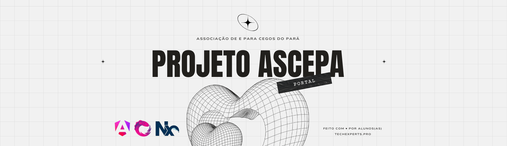

<div align="center">
<a href="#">
    
</a>

<br/>
<br/>

   [](https://sonarcloud.io/summary/new_code?id=portal-ascepa)

<div align="center">
    <a href="#">Home Page</a> |
    <a href="#">Documentação</a> |
    <a href="https://github.com/techexpertspro/portal-ascepa/wiki">Wiki</a> |
    <a href="https://github.com/techexpertspro/portal-ascepa/discussions">Discussions</a>
</div>
</div>

<br/>
<br/>

<div align="center"><strong>Bem-vindo ao repositório do Portal ASCEPA! Este projeto é uma parceria entre a ONG Associação de e para Cegos do Pará e TechExperts.Pro para melhorar a presença online e a experiência do usuário, focando em fornecer uma plataforma abrangente para membros, associados e visitantes.</strong></div>
<br />
<br />

## Pré requisitos

- Node v20+
- Npm v10+
- Git v2+

## ⚡ Início rápido

1. Faça o clone da aplicação

```sh
git clone git@github.com:techexpertspro/portal-ascepa.git
```

2. Instale as dependências do projeto

```sh
npm install
```

3. Rode no terminal para iniciar o servidor local

```sh
npx nx serve portal-ascepa
```

4. Para build de produção (`dist/` ou `build/`), execute no terminal

```sh
npx nx build portal-ascepa
```

5. Para visualizar o gráfico da estrutura de trabalho do projeto, execute no terminal

```sh
npx nx graph
```

## Conecte-se conosco

Para dúvidas, feedbacks ou sugestões você pode abrir uma issue diretamente no nosso projeto, ou acessar nossa plataforma:

- [Tech Experts PRO](https://techexperts.pro/)

## Como contribuir

Para contribuir acesse nosso guia de contribuição disponibilizado no [CONTRIBUTING.md](https://github.com/techexpertspro/portal-ascepa/blob/main/docs/CONTRIBUTING.md)

## Testes Unitários

O monorepo do Portal ASCEPA inclui módulos chamados home, layout e shared-ui. Para garantir a qualidade e a integridade do código, é essencial executar testes unitários regularmente. Abaixo estão os comandos para executar os testes de cada módulo individualmente, além de informações úteis sobre as flags que podem ser usadas.

### Executando Testes Unitários

Rodando todos os testes:

Para rodar os testes unitários de todos os módulos no monorepo de uma vez, utilize:

```sh
npx nx test
```

#### Testando um módulo específico:

Para executar testes unitários de um módulo específico, como home, layout ou shared-ui, utilize o seguinte comando, substituindo <module> pelo nome do módulo desejado:

```sh
npx nx test <module>
```

Exemplo para testar o módulo home:

```sh
npx nx test home
```

### Flags Úteis para Testes

**--watch**: Use esta flag para rodar os testes em modo de observação. Isso permite que os testes sejam executados automaticamente sempre que uma mudança no código é detectada. Muito útil durante o desenvolvimento ativo!

```sh
npx nx test <module> --watch
```

**--code-coverage**: Para gerar um relatório de cobertura de código e identificar quais partes do código não foram cobertas pelos testes, utilize:

```sh
npx nx test <module> --code-coverage
```

O relatório de cobertura será gerado na pasta coverage dentro da pasta do módulo.

**--runInBand**: Executa os testes sequencialmente em vez de em paralelo. Esta flag é útil se você estiver enfrentando problemas relacionados à concorrência de recursos, como uso de memória.

```sh
npx nx test <module> --runInBand
```

**--only-failures**: Roda apenas os testes que falharam na última execução, economizando tempo ao corrigir falhas específicas.

```sh
npx nx test <module> --only-failures
```

## Contribuidores ❤️

<a href="https://github.com/techexpertspro/portal-ascepa/graphs/contributors">
  
</a>

## Licença

Licensed under the MIT License, Copyright ©2024 - TechExperts.Pro
